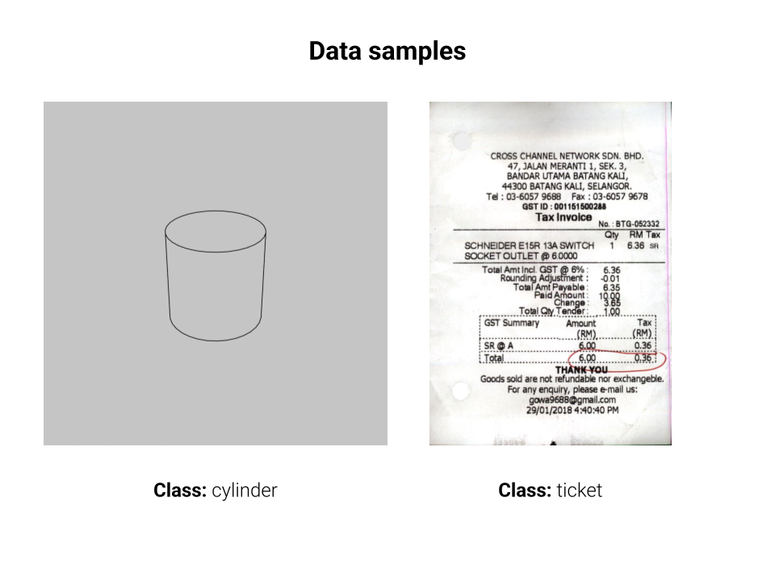
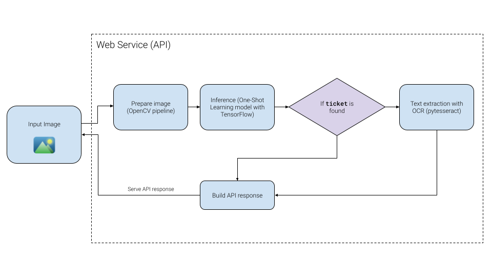

# Image classification using One-Shot Learning Techniques

This repository contains a technical demo for an **Image Classification** system of CAD figure and a ticket. 

The goal of this project is to showcase a production-ready workflow that combines:

- **Computer vision (OpenCV)** for preprocessing and image handling.
- **Deep learning (TensorFlow)** for image classification.
- **Optical Character Recognition (OCR with pytesseract)** for text extraction.
- **Web service (Flask/FastAPI)** to expose inference via REST API.

## 📊 System Diagram

_A general overview of the system integrating the complete workflow:_

## 🧩 Workflow

The system is divided into several stages:

1. **Preprocessing (OpenCV).** The module `src/dataset.py` contains a function to prepare images, which includes an OpenCV pipeline that:
    - Loads an image and converts it to grayscale from a given path.
    - Binarizes the image using an Otsu threshold.
    - Applies a morphological transformation (erosion, dilation or none).
    - Resizes the image to a given size.
    - Adds the dimension channel (1).
    - Normalizes the image to range [0, 1].
    - The dataset includes 2 classes:
        - Cylinder
        - Ticket (this ticket is used with `pytesseract`in a posterior process)

2. **Model training (TensorFlow).** The content for this task is conteined in several files:
    - The module `src/fsl.py` includes a function to build a model that uses a Few-Shot Learning (FSL) technique with a Siamese Network for image classifiaction tasks.
    - The model is trained using the `notebooks/Train Siamese Network.ipynb` Jupyter Notebook. 
    - The trained model was saved in the `models/siamese.weights.h5` file.

3. **OCR Extraction (Tesseract).**  For this task, an integration with `pytesseeract`is added in the web service (API):
   - If the classified images corresponds to the `ticket` class, then the OCR is run over the image.

4. **API Service (Flask/FastAPI)**  
   - `/` endpoint: Health check for monitoring.  
   - `/inference` endpoint: Receives an image and returns the resulting score.  
   - `/inference-ocr` endpoint: Receives an image and returns the resulting score, as well as the detected text.

## Future work/Improvements

- **Containerization (Docker)** for deployment in scalable environments.
- **Security** with an API bearer/auth token.
- **Deployment** in a production environment.
- **Model improvement** and extension to use more classes.

## Credits

The dataset used in this project was completely built using the following public datsets from Kaggle:
- [3D Geometric Objects in 2D plane (Sketch-like)](https://www.kaggle.com/datasets/breadzin/3d-geometric-objects-in-2d-plane-sketch-like)
- [Find it again! Dataset](https://www.kaggle.com/datasets/nikita2998/find-it-again-dataset)